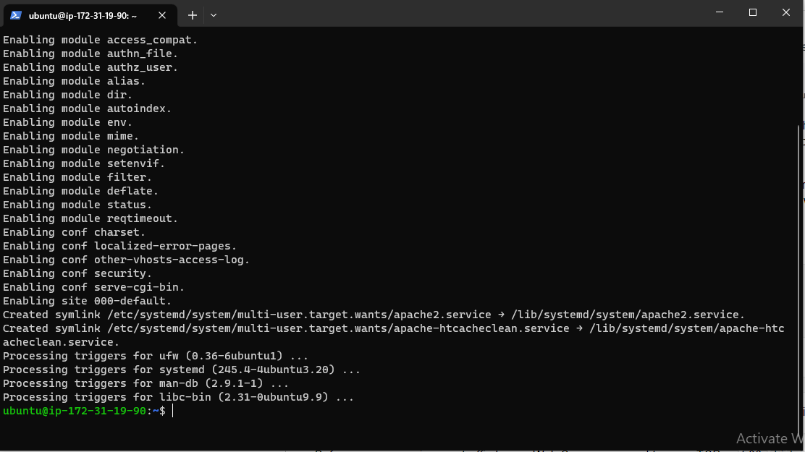
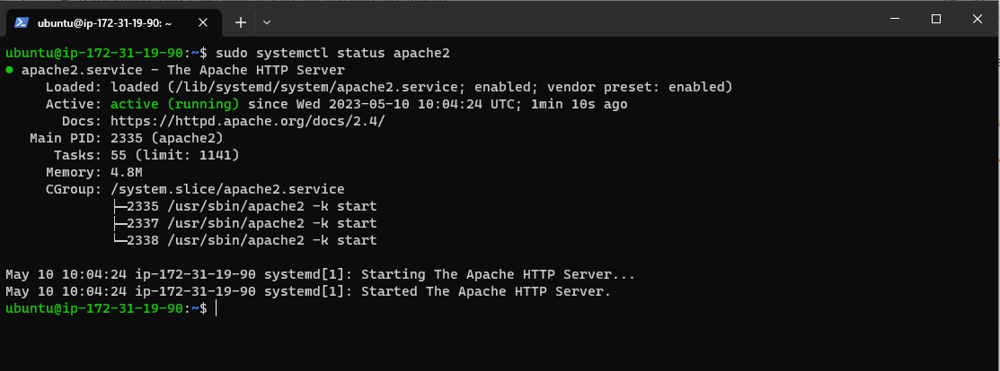
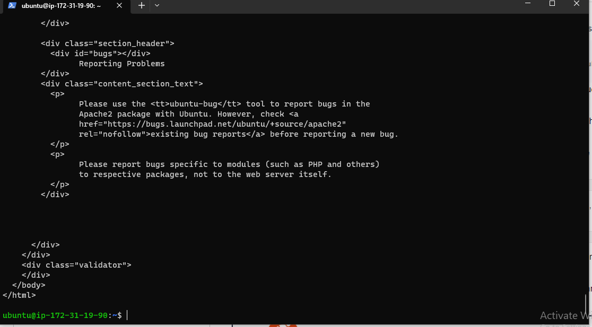
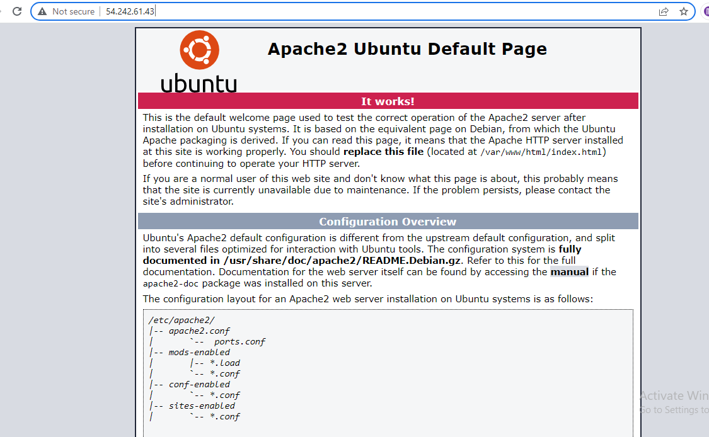
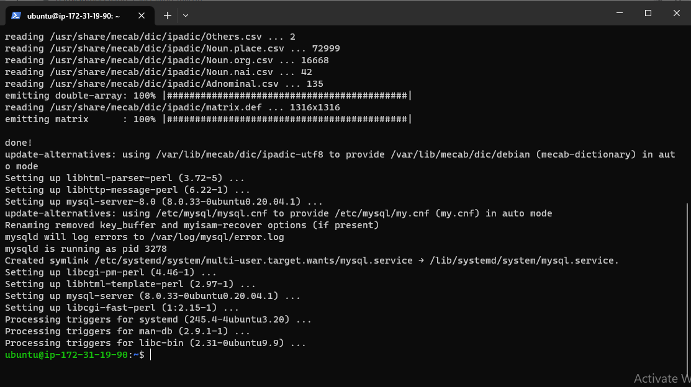
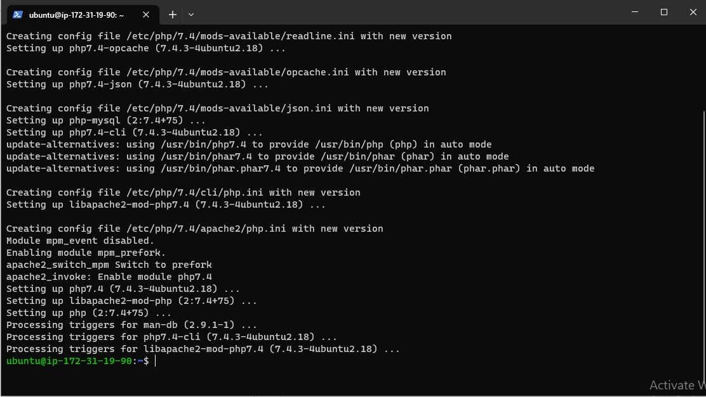
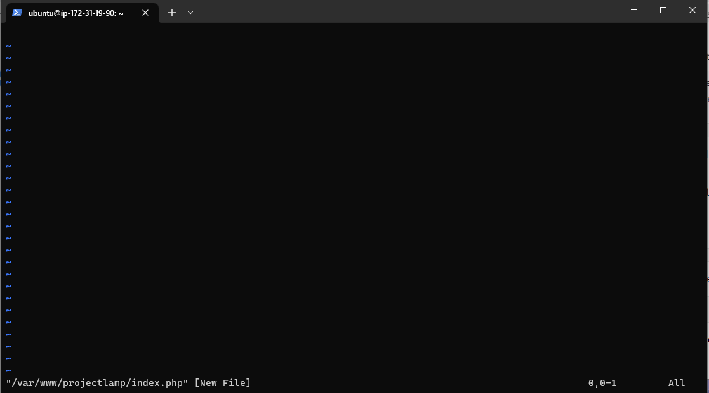
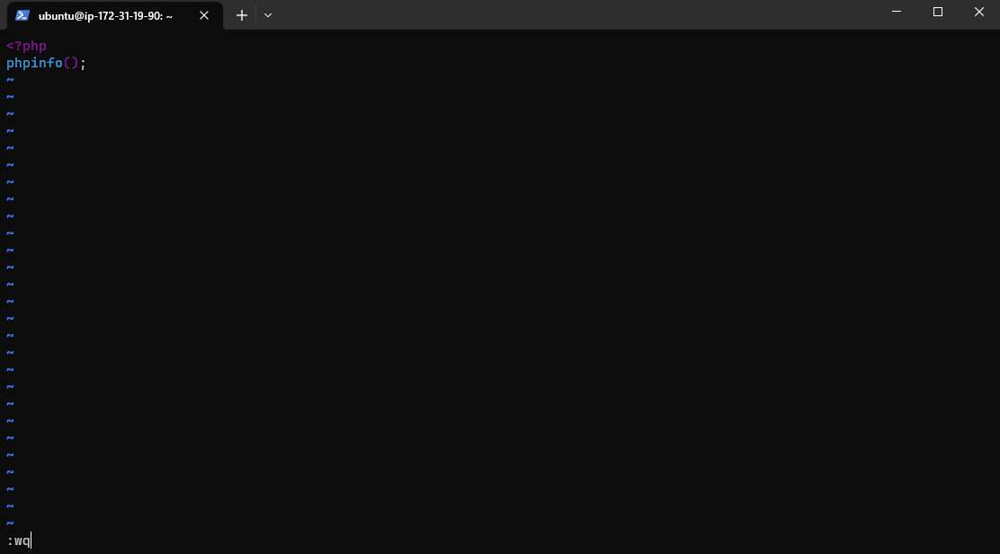
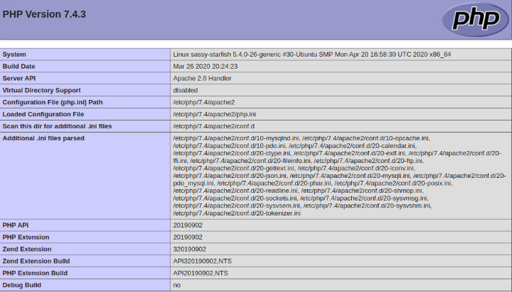

# Project 1: Lamp stack implementation

### Firstly, I connected my Ec2 instance and remote into the terminal. After that, I took the following steps to get this project 1 done.
## Step 1- Installing apache and updating the firewall
1. I ran `sudo apt update` to update a list of packages in package manager and below is the output.

2. I ran `sudo apt install apache2` to run apache2 package installation and beow is the output.

3. To verify that apache2 is running as a Service in my OS I used the following command `sudo systemctl status apache2` and below is the output.

4. I went to Aws to add a rule to EC2 configuration to open inbound connection through port 80 since the one i have is port 22 which comes by default to be able to receive any traffic by my Web Server. After that, I ran ` curl http://54.242.61.43/:80` to access it locally in my Ubuntu shell and below is the output.

I also ran `http://54.242.61.43:80` to access it on my internet browser and got the oputput below.

## Step 2- Installing MYSQL
1. I ran `sudo apt install mysql-server` to to acquire and install this software and got the output below.

2. I ran `sudo mysql` to log in to the MySQL console and below is the output.

3. I ran `ALTER USER 'root'@'localhost' IDENTIFIED WITH mysql_native_password BY 'PassWord.1';` to set a password for the root user, using mysql_native_password as default authentication method and got the output below.

After that, I ran `exit` to exit the MySQL shell and below is th output.

4. I also ran `sudo mysql_secure_installation` a security script that comes pre-installed with MySQL to remove some insecure default settings and lock down access to my database system and below are the output (the top and end part).

5. I ran `sudo mysql -p` to test if i am able to log in to the MySQL console and below is the output.

Then, exit MYSQL console, the output is below.

## Step 3- Installing PHP
1. I ran `sudo apt install php libapache2-mod-php php-mysql` to install PHP packages and below is the output.

2. I ran `php -v` to confirm my PHP version and below is the output.

## Step 4- Creating a virtual host for website using apache
1. I ran `sudo mkdir /var/www/projectlamp` to Create the directory for projectlamp, ` sudo chown -R $USER:$USER /var/www/projectlamp`  to assign ownership of the directory with my current system user and below are the outputs.

2. I created and opened a new configuration file in Apache’s sites-available directory using a vi editor. so, I ran `sudo vi /etc/apache2/sites-available/projectlamp.conf` and hit i to be able to edit then, pasted in my bare-bones configuration, hit esc botton then, type :wq and hit ente to save the file. And below are my outputs respectively.

3. I ran `sudo ls /etc/apache2/sites-available` to  show the new file in the sites-available directory and below is the output.

4. I ran `sudo a2ensite projectlamp` to enable the new virtual host and `sudo a2dissite 000-default` to  disable the default website that comes installed with Apache and below are the outputs respectively.
 

5. I ran `sudo apache2ctl configtest` to make sure your configuration file doesn’t contain syntax errors and `sudo systemctl reload apache2` to reload Apache so these changes take effect below is the output.

6. I created an hmtl file `sudo echo 'Hello LAMP from hostname' $(curl -s http://169.254.169.254/latest/meta-data/public-hostname) 'with public IP' $(curl -s http://169.254.169.254/latest/meta-data/public-ipv4) > /var/www/projectlamp/index.html` to test that the virtual host works as expected and below is the output.

7. Ran `http://http://54.242.61.43/:80` to open my website URL using IP address and `http://ec2-54-242-61-43.compute-1.amazonaws.com:80` to open my website using DNS name and below are the outputs respectively.

## Step 5- Enable PHP on the website
1. I ran `sudo vim /etc/apache2/mods-enabled/dir.conf` and pasted the file to edit and below is the output.

2. I ran `sudo systemctl reload apache2` after saving and closing the file, and reloaded Apache so the changes takes effect and below is the output.

3. Created a new file named index.php inside my custom web root folder by running `vim /var/www/projectlamp/index.php` and pasting my text which gave the outputs below respectively.

## This is how i carried out my project 1 . Thanks!